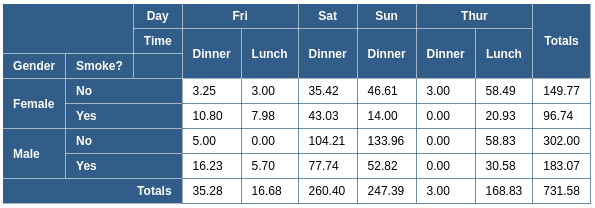

# cl-perspective

## Introduction

cl-perspective is an open-source Typescript Perspective / Pivot Table component.

## Usage

> Data from [Rdatasets](https://raw.githubusercontent.com/nicolaskruchten/Rdatasets/master/csv/reshape2/tips.csv)

> `h` is a general function to create element, refer [dom.ts](./src/dom.ts) or [cl-pure-render](https://github.com/gosion/cl-pure-render.git)

> You can also try the `h` function provided by `Vue` or `React`

```typescript
const table = new Table({
    columns: [
      { name: "day", text: "Day" },
      { name: "time", text: "Time" },
    ],
    rows: [
      { name: "sex", text: "Gender" },
      { name: "smoker", text: "Smoke?" },
    ],
    data,
    aggregator: aggregator.sum("tip"),
    formatter: (val: number) => val.toFixed(2),
    colTotal: true,
    rowTotal: true,
    // colTotalText: "Sum / Col",
    // rowTotalText: "Sum / Row",
});

const el = table.render(h);

document.body.appendChild(el);
```

Result:



